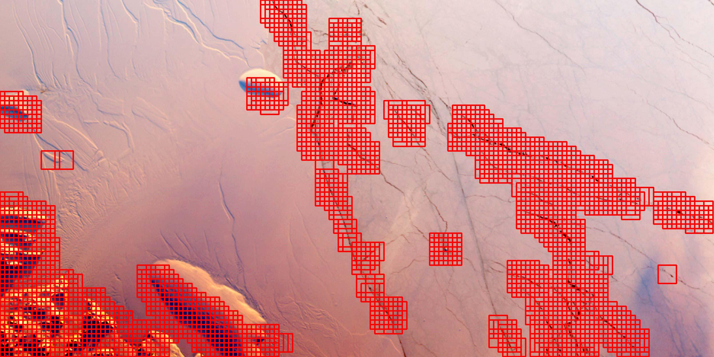

# Crack classification with Tensorflow/Keras

This is part of project that attempts to reproduce the paper *Deep Learning-based Crack Detection Using Convolutional Neural Network and Naıve Bayes Data Fusion.* [1] 

Two CNN models for crack detection are implemented in Tensorflow/Keras. A very simple model to test the workflow on low-end computers (that we call SimpleNet) and the model from the original paper (which we call CrackNet).

Any of these models is then used inside a service that takes an image as an input, scans it for cracks, and returns a list of the bounding boxes with the probabilities of each being a crack. The *CNNDetector* in the following nuclear plant inspection processing pipeline is implemented consuming this service-


#### SimpleNET trained on cracks dataset

SimpleNET was trained on a public available cracks in concrete surface dataset [2] to be used as the model in the CNN detector for the nuclear plant crack inspection pipeline.

##### Training parameters and results

Original dataset consists of 20.000 samples for each class. For training session 18.000 samples were used for training and 2.000 samples were reserved for validation.

Some data augmentation was performed using Keras ImageDataGenerator ( see: https://keras.io/preprocessing/image/).

| Parameter                 | Value                     |
| ------------------------- | ------------------------- |
| Optimizer                 | ADAM                      |
| Loss function             | Categorical Cross Entropy |
| Epochs                    | 30                        |
| Batch size                | 32                        |
| Data augmentation rescale | 1./255                    |
| Shear range               | 0.2                       |
| Zoom range                | 0.2                       |
| Horizontal flip           | True                      |

###### Learning curves

Accuracy of near 98% was obtained against test set for checkpoint file: simplenet_cracks_weights.29-0.01.hdf5.


Testing against a real high res image containing cracks, the model fails to detect some positives and it is evident that more negative examples are needed for scenarios when surface contains elevations or other variations (bottom left section):



### CrackNET trained on cracks dataset

WIP

## Instructions

### Project organization

```
./
	/data
	/doc
	/model-checkpoints
	/models
	/src
	/tensorboard_logs
	/training_logs
```

where:

- **data**: contains datasets and other media.
- **doc**: documentation files.
- **model-checkpoints**: checkpoints generated during model training in hd5 format.
- **models**: models converted to Tensorflow SavedModel format ready for deployment with tensorflow serving.
- **src**: notebooks and python scripts for model training and generating reports from training logs.
- **tensorboard_logs**: path to store tensorboard logs.
- **training_logs**: training logs in CSV to generate learning curves in reports.

### Train a model using docker image

**Note:**  the following instruction steps use a [custom docker image](https://hub.docker.com/r/nhorro/tensorflow1.12-py3-jupyter-opencv) based on official Tensorflow Docker image for GPU. 

Tested with Ubuntu 18.04 and Geforce GTX 950M with nvidia driver version 390.116.

#### Steps

1. Clone repository

```bash
git clone https://github.com/nhorro/tensorflow-crack-classification.git
```

2. Download crack dataset

```bash
wget https://data.mendeley.com/datasets/5y9wdsg2zt/1/files/c0d86f9f-852e-4d00-bf45-9a0e24e3b932/Concrete%20Crack%20Images%20for%20Classification.rar
mkdir -pv data/datasets/cracks
unrar x Concrete\ Crack\ Images\ for\ Classification.rar ./data/datasets/cracks
```

3. Split the original dataset in training and evaluation (suggested: 80%-20%):

```bash
python src/utils/split_dataset.py --dir=data/datasets/cracks/ --train=80 --test=20 --output=data/datasets/cracks_splitted8020
```

4. Run docker container for development (note: --network="host" is to enable access to the tensorflow serving API):

```bash
docker run -it --rm --runtime=nvidia -v $(realpath $PWD):/tf/notebooks --name tensorflowdev1 --network="host" -p 8888:8888 custom-tensorflow1.12-py3-jupyter-opencv
```

4. Train the model from a notebook:

   1. Open notebook Train and export CNN model.ipynb and run. 

5. Optional: monitor and debug with tensorboard. 

   1. Install tensorboard if not already installed:

   ```bash
   pip install tensorboard # if not installed
   ```

   Run tensorboard and connect to http://localhost:6006:

   ```bash
   tensorboard --logdir=tensorboard_logs
   ```

6. Export the model as Tensorflow SavedModel format to deploy with Tensorflow Serving.

   1. Open notebook KerasToTensorflowServing.ipynb.
   2. Select a valid hd5 file from model-checkpoints and run notebook.

### Serve a model using tensorflow-serving docker image

Official image tensorflow/serving:1.12.3-gpu is used for serving.

```bash
export SERVING_MODEL=simplenet_cracks8020
docker run -t --rm --runtime=nvidia -p 8501:8501 -v $(realpath $PWD/models):/models/ --name crack_classification_service -e MODEL_NAME=$SERVING_MODEL tensorflow/serving:1.12.3-gpu
```
#### Using the REST API

Query model status to check model availability.

```bash
curl http://localhost:8501/v1/models/simplenet_cracks8020
```

```json
{
 "model_version_status": [
  {
   "version": "1",
   "state": "AVAILABLE",
   "status": {
    "error_code": "OK",
    "error_message": ""
   }
  }
 ]
}
```

Query model metadata to obtain method signature definition (in this case, predict method input is a 64x64x3 image of DT_FLOAT elements).

```bash
 curl http://localhost:8501/v1/models/simplenet_cracks8020/metadata
```

```json
{
"model_spec":{
 "name": "simplenet_cracks8020",
 "signature_name": "",
 "version": "1"
}
,
"metadata": {"signature_def": {
 "signature_def": {
  "serving_default": {
   "inputs": {
    "input_image": {
     "dtype": "DT_FLOAT",
     "tensor_shape": {
      "dim": [
       {
        "size": "-1",
        "name": ""
       },
       {
        "size": "64",
        "name": ""
       },
       {
        "size": "64",
        "name": ""
       },
       {
        "size": "3",
        "name": ""
       }
      ],
      "unknown_rank": false
     },
     "name": "conv2d_6_input:0"
    }
   },
   "outputs": {
    "dense_7/Softmax:0": {
     "dtype": "DT_FLOAT",
     "tensor_shape": {
      "dim": [
       {
        "size": "-1",
        "name": ""
       },
       {
        "size": "2",
        "name": ""
       }
      ],
      "unknown_rank": false
     },
     "name": "dense_7/Softmax:0"
    }
   },
   "method_name": "tensorflow/serving/predict"
  }
 }
}
}
}
```

An example notebook of how to consume the API to classify an image [is included here](./src/notebooks/CrackClassificationRESTAPIExample.ipynb)


#### Using the GRPC API

WIP


## References

- [1] *Deep Learning-based Crack Detection Using Convolutional Neural Network and Naıve Bayes Data Fusion.* 
- [2] Özgenel, Çağlar Fırat (2018), “Concrete Crack Images for Classification”, Mendeley Data, v1: http://dx.doi.org/10.17632/5y9wdsg2zt.1

