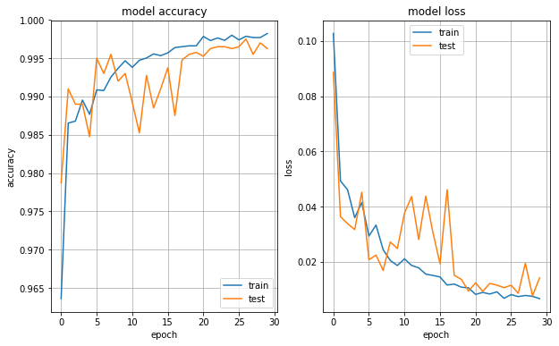

# Crack classification with Tensorflow/Keras

This is part of project that attempts to reproduce the paper *Deep Learning-based Crack Detection Using Convolutional Neural Network and Naıve Bayes Data Fusion.* [1] 

Two CNN models for crack detection are implemented in Tensorflow/Keras. A very simple model to test the workflow on low-end computers (that we call SimpleNet) and the model from the paper (CrackNet).

#### SimpleNET trained on cracks dataset

SimpleNET was trained on a public available cracks in concrete surface dataset [2] to be used as the model in the CNN detector for the nuclear plant crack inspection pipeline.

##### Training parameters and results

Original dataset consists of 20.000 samples for each class. For training session 18.000 samples were used for training and 2.000 samples were reserved for validation.

Some data augmentation was performed using Keras ImageDataGenerator ( see: https://keras.io/preprocessing/image/).

| Parameter                 | Value                     |
| ------------------------- | ------------------------- |
| Optimizer                 | ADAM                      |
| Loss function             | Categorical Cross Entropy |
| Epochs                    | 30                        |
| Batch size                | 32                        |
| Data augmentation rescale | 1./255                    |
| Shear range               | 0.2                       |
| Zoom range                | 0.2                       |
| Horizontal flip           | True                      |

###### Learning curves

Accuracy of near 98% was obtained against test set for checkpoint file: simplenet_cracks_weights.29-0.01.hdf5.



Testing against a real high res image containing cracks, the model fails to detect some positives and it is evident that more negative examples are needed for scenarios when surface contains elevations or other variations (bottom left section):


### CrackNET trained on cracks dataset

WIP

## Instructions

### Project organization

```
./
	/data
	/doc
	/model-checkpoints
	/models
	/src
	/tensorboard_logs
	/training_logs
```

where:

- **data**: contains datasets and other media.
- **doc**: documentation files.
- **model-checkpoints**: checkpoints generated during model training in hd5 format.
- **models**: models converted to Tensorflow SavedModel format ready for deployment with tensorflow serving.
- **src**: notebooks and python scripts for model training and generating reports from training logs.
- **tensorboard_logs**: path to store tensorboard logs.
- **training_logs**: training logs in CSV to generate learning curves in reports.

### Train a model using docker image

**Note:**  the following instruction steps use a [custom docker image](https://hub.docker.com/r/nhorro/tensorflow1.12-py3-jupyter-opencv) based on official Tensorflow Docker image for GPU. 

Verifified with Ubuntu 18.04 and Geforce GTX 950M with nvidia driver version 390.116.

#### Steps

Clone repository

```bash
git clone https://github.com/nhorro/tensorflow-crack-classification.git
```

Download crack dataset

```bash
wget https://data.mendeley.com/datasets/5y9wdsg2zt/1/files/c0d86f9f-852e-4d00-bf45-9a0e24e3b932/Concrete%20Crack%20Images%20for%20Classification.rar
mkdir -pv data/datasets/cracks
unrar x Concrete\ Crack\ Images\ for\ Classification.rar ./data/datasets/cracks
```

Prepare a a training set and evaluation set.

Train the model

Export the model as Tensorflow SavedModel format to deploy with Tensorflow Serving.

### Serve a model using tensorflow-serving docker image

Official image tensorflow/serving:1.12.3-gpu is used for serving.

```bash
export SERVING_MODEL=febrero-cpu-friendly_weights
docker run -t --rm --runtime=nvidia -p 8501:8501 -v $(realpath $PWD/models):/models/ -e MODEL_NAME=$SERVING_MODEL tensorflow/serving:1.12.3-gpu
```
Query model status from:


http://localhost:8501/v1/models/febrero-cpu-friendly_weights

Query model metadata:


http://localhost:8501/v1/models/febrero-cpu-friendly_weights/metadata


## References

- [1] *Deep Learning-based Crack Detection Using Convolutional Neural Network and Naıve Bayes Data Fusion.* 
- [2] Özgenel, Çağlar Fırat (2018), “Concrete Crack Images for Classification”, Mendeley Data, v1: http://dx.doi.org/10.17632/5y9wdsg2zt.1

